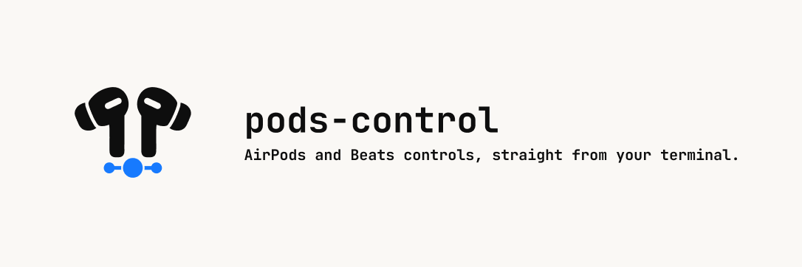

# airpods-control

<p align="center">
  <picture>
    <source media="(prefers-color-scheme: dark)" srcset=".github/assets/airpods-control-banner-dark.png">
    <source media="(prefers-color-scheme: light)" srcset=".github/assets/airpods-control-banner-light.png">
    
  </picture>
</p>

<p align="center">
  <a href="https://github.com/raulgg/airpods-control/actions/workflows/ci.yml"></a>&nbsp;
  <a href="https://github.com/raulgg/airpods-control/releases/latest"></a>&nbsp;
  <a href="#compatibility"></a>&nbsp;
  <a href="https://github.com/raulgg/homebrew-tap/blob/main/Formula/airpods-control.rb"></a>&nbsp;
  <a href="LICENSE"></a>
</p>

Control AirPods listening modes and Conversation Awareness from the command line
without Control Center, a menu bar app, or Accessibility permission.

```console
$ airpods-control status
My AirPods Pro:
  Listening mode: transparency
  Conversation Awareness: off
  Selected as audio output: yes
  Selected as audio input: no
$ airpods-control listening-mode set noise-cancellation
ok
```

`airpods-control` talks directly to private macOS audio interfaces used by
AirPods. A successful write means the selected macOS provider reports the
requested state within a bounded readback window; it is not a direct accessory
acknowledgement. Each operational command performs one operation and exits
without polling in the background or automating the UI.

## Features

- Read, set, list, or cycle the `off`, `transparency`, `adaptive`, and
  `noise-cancellation` listening modes.
- Read or set Conversation Awareness.
- Report listening mode, Conversation Awareness, and whether each eligible
  connected AirPods or Beats device represented by Core Audio is selected as
  the macOS audio output or input with one `status` command.
- Select a compatible output device by exact name.
- Use it from scripts, hotkeys, Stream Decks, Shortcuts, or `launchd`.
  Operational commands have stable stdout, documented exit codes, JSON output,
  and opt-in debug diagnostics.

## Requirements

- macOS (developed and tested on Tahoe 26).
- A compatible AirPods or Beats device connected over Bluetooth. Operational
  listening-mode commands can use either the selected private AV output-device
  interface or an eligible mapped Core Audio HAL output endpoint. Conversation
  Awareness and `support-report` still require the private AV interface
  described in [device compatibility](docs/compatibility.md).
- Command Line Tools (`clang` and `swiftc`) for Homebrew or source installs.
  Install them with `xcode-select --install`; full Xcode is not required. The
  optional signed binary archive does not require a compiler.

## Install

### Homebrew

```sh
brew install raulgg/tap/airpods-control
```

The formula downloads the source and compiles the native architecture locally.
It does not consume either binary bundle described below and remains the
recommended installation path.

### Signed binary archive

Each GitHub release can also include an optional universal macOS archive for a
faster install without Command Line Tools. Download the archive and
`SHA256SUMS` from the release. GitHub CLI authentication is required to verify
who built the archive before extracting or installing it:

```sh
(
set -eu
VERSION=x.y.z
curl -fLO "https://github.com/raulgg/airpods-control/releases/download/v$VERSION/airpods-control-$VERSION-macos-universal.tar.gz"
curl -fLO "https://github.com/raulgg/airpods-control/releases/download/v$VERSION/SHA256SUMS"
shasum -a 256 -c SHA256SUMS
SOURCE_DIGEST=$(gh api \
  "repos/raulgg/airpods-control/commits/refs/tags/v$VERSION" \
  --jq .sha)
gh attestation verify \
  "airpods-control-$VERSION-macos-universal.tar.gz" \
  --repo raulgg/airpods-control \
  --signer-workflow \
    raulgg/airpods-control/.github/workflows/binary-release.yml \
  --source-ref refs/heads/main \
  --source-digest "$SOURCE_DIGEST" \
  --deny-self-hosted-runners
tar -xzf "airpods-control-$VERSION-macos-universal.tar.gz"
sudo "./airpods-control-$VERSION-macos-universal/install.sh"
)
```

The executable and its companion dylib are signed with the same Developer ID,
submitted to Apple's notarization service, and covered by a GitHub artifact
attestation. The checksum detects download corruption; the required attestation
check authenticates the producing repository, workflow, protected source ref,
exact tagged source commit, and use of GitHub-hosted runners. Do not run
`install.sh` if either check fails.

Run `sudo ./uninstall.sh` from the extracted archive to remove this install.
See the [security and trust model](SECURITY.md) before choosing between a local
source build and a published binary.

### From source

```sh
git clone https://github.com/raulgg/airpods-control
cd airpods-control
make
sudo make install
```

By default, `make install` uses `/usr/local`. It honors `PREFIX` and `DESTDIR`,
so a user-local installation needs no `sudo`:

```sh
make install PREFIX="$HOME/.local"
```

The build produces a universal (arm64 + x86_64), ad-hoc-signed executable and
its companion `avbypass.dylib`. Run `sudo make uninstall` to remove them.

### Experimental binary bundle

The `Experimental Binary Bundle` workflow publishes seven-day artifacts for
testing. They are not GitHub release assets, Developer ID signed, or notarized;
prefer Homebrew or a source build for normal installation.

Before using an artifact, confirm that its name and `BUILD.txt` identify the
commit and native runner from the originating workflow run. Then verify and
install it into a user-owned prefix:

```sh
shasum -a 256 -c SHA256SUMS
tar -xzf airpods-control-x.y.z-macos-universal.tar.gz
cd airpods-control-x.y.z-macos-universal
./install.sh "$HOME/.local"
```

Use `./uninstall.sh "$HOME/.local"` from the same extracted directory to remove
it. The checksum verifies that the archive matches the manifest in the
artifact; the originating GitHub workflow run and commit establish who produced
it. Because the bundle is ad-hoc signed and unnotarized, Gatekeeper may block a
quarantined download. Do not disable Gatekeeper globally; use Homebrew or build
from source instead.

## Quick start

```sh
# Read or change the listening mode
airpods-control listening-mode get
airpods-control listening-mode set noise-cancellation

# List supported modes or cycle between them
airpods-control listening-mode list
airpods-control listening-mode cycle

# Read or change Conversation Awareness
airpods-control conversation-awareness get
airpods-control conversation-awareness set off

# Read status for every eligible device represented by Core Audio
airpods-control status

# Target a device or request structured output
airpods-control --device "My AirPods Pro" listening-mode get
airpods-control status --device "My AirPods Pro" --json
```

`listening-mode` can be shortened to `lm`, and `conversation-awareness` to `ca`;
`status` has no alias. Without `--device`, `status` reports every eligible
AirPods or Beats record derived from the currently available Core Audio device
list, even when it is not the selected audio output. The individual resource
commands retain their documented adapters. Listening-mode commands prefer the
selected output, use a unique eligible HAL device when unselected, and prompt in
a fully interactive terminal if several HAL targets remain. Automated HAL
ambiguity fails closed; leftover AV records do not enter the HAL chooser. On
systems where HAL control is entirely unavailable, the prior AV-only behavior
continues to use the first compatible AV output. Run
`airpods-control --help` for built-in help. The
[complete CLI reference](docs/cli.md) covers aliases, JSON output, diagnostics,
write verification, and exit codes. After installation, you can also run
`man airpods-control`.

## Documentation

- [CLI reference](docs/cli.md)
- [Device compatibility](docs/compatibility.md)
- [Hardware testing](docs/hardware-testing.md)
- [Security and trust model](SECURITY.md)
- [Contributing](CONTRIBUTING.md)

## How it works

Conversation Awareness uses the private `AVOutputDevice` control object in
`AVRouting.framework`. This object is macOS's per-endpoint audio control
surface. Listening-mode commands use that same provider when a
command-ready AirPods endpoint is selected, and the mapped BTAudio HAL
(Core Audio's hardware abstraction layer) exposes `lstm`/`lsms` properties
when the device is unselected. Provider selection and
all pre-write state, capability, setter, and bounded readback operations are
sticky for one command. The CLI never changes the default route or starts an
audio stream. `status` remains a separate read-only Core Audio adapter.

The inventory starts with macOS's public list of available Core Audio devices.
It accepts an ordinary, nonaggregate classic-Bluetooth endpoint when the
endpoint is alive and ready, has an audio stream, and maps to an
`IOBluetoothDevice`. An undocumented HAL property identifies Apple audio
hardware. If that property is unavailable, `status` falls back to an allowlisted
Apple or Beats manufacturer. Input and output endpoints form one record only
when their mapped objects compare equal in both directions. The output endpoint
supplies the preferred name. Names are for display and `--device` matching, not
identity.

Input and output selection are checked independently. For each direction,
`status` maps the ordinary default Core Audio endpoint and compares the result
with the record's mapped Bluetooth object. Aggregate routes and known unrelated
transports produce `no`. Bluetooth LE, USB, unknown transports, missing
properties, and unavailable mappings produce `unknown`. A failed read or mapper
call is reported as a read error. This includes failures while reading the
default route, device class, or transport.

An inactive endpoint may still expose its current listening mode through an
undocumented HAL property. The mapped Bluetooth object is the fallback when the
HAL property is unavailable or neutral, or when its read fails. The active AV
endpoint has the highest priority when it can be joined safely to the default
output. Unknown AV or HAL values, and conflicting HAL values, leave the mode
`unknown` rather than falling back.

The active-output join translates
`AVOutputContext.associatedAudioDeviceID` through Core Audio and compares the
result with the stable default output. That output's mapped Bluetooth object
must match the status record. The probe also samples `AVOutputDevice.deviceID`
before and after to catch a route change. Conversation Awareness is `unknown`
when this join is unavailable.

Core Audio handles and the identifiers used by the enrichment probe stay inside
the process. The CLI does not parse or log them. Inventory and selection do not
read Bluetooth addresses, Core Audio UIDs, or private route identifiers, and
raw HAL values are not emitted. `support-report` does not use this status path.

To reach the shared system audio context used by feature controls, the
`airpods-control` process loads the small interpose library in
[`Sources/AVBypass/bypass.c`](Sources/AVBypass/bypass.c). The library satisfies
one private entitlement check inside that process and passes every other
entitlement query through unchanged. It does not elevate privileges or affect
other processes.

Source builds and experimental CI bundles use ad-hoc signatures. Optional
release archives instead sign the executable and dylib with the same Developer
ID and grant only the narrow hardened-runtime entitlement needed to read DYLD
environment variables. Library validation remains enabled and accepts the
same-team companion library. Review the
[security documentation](SECURITY.md) before choosing an installation path.

## Compatibility

Apple can change or remove this private API in any macOS update. Compatibility
varies by device, firmware, and macOS version; see the [device and capability
matrix](docs/compatibility.md) for current results. Reports are welcome, but a
report does not by itself establish support.

To share compatibility details:

1. Connect exactly one compatible AirPods or Beats device as a macOS output
   device.
2. Run `airpods-control support-report`.
3. Choose whether to run the consented write tests when asked.
4. Review the report, add any safe optional notes, complete the privacy
   confirmation, and submit the GitHub issue if you choose to open it.

`support-report` builds the report locally and prints it before offering to open
GitHub. It never reads the customizable device name, firmware version, serial
numbers, Bluetooth/MAC addresses, account data, or raw system dumps and logs. It
does not enumerate the Core Audio status inventory, query selected audio routes,
call the selection mapper, run active-output enrichment, or read routing
identifiers. It does not use the clipboard, send telemetry, or submit a report.
Opening the prefilled form is your choice, and GitHub still requires you to
review and submit the issue.

The optional write tests run only with your consent (the interactive question or
`--with-write-tests`). They temporarily switch through the advertised listening
modes recognized by this CLI, toggle Conversation Awareness, and then try to
restore the captured initial settings. The tests may be disruptive: mode
switches are audible and noise control changes while the device is worn. Do not
run them during a call. Consent only if you accept this. Without consent,
`support-report` does not change device settings or intentionally interrupt
audio.

The [CLI reference](docs/cli.md#contributor-compatibility-report) documents the
exact report contents and privacy rules, and its
[write-test section](docs/cli.md#consented-write-tests) covers the plan, skip
rules, verdict vocabulary, restoration behavior, and exit codes.

## Credits

[NoiseBuddy](https://github.com/insidegui/NoiseBuddy) by Guilherme Rambo
documented the AVFoundation technique used by this project.

`airpods-control` is an independent tool and is not endorsed by Apple. AirPods
and AirPods Pro are trademarks of Apple Inc.

## License

MIT. See [LICENSE](LICENSE).
